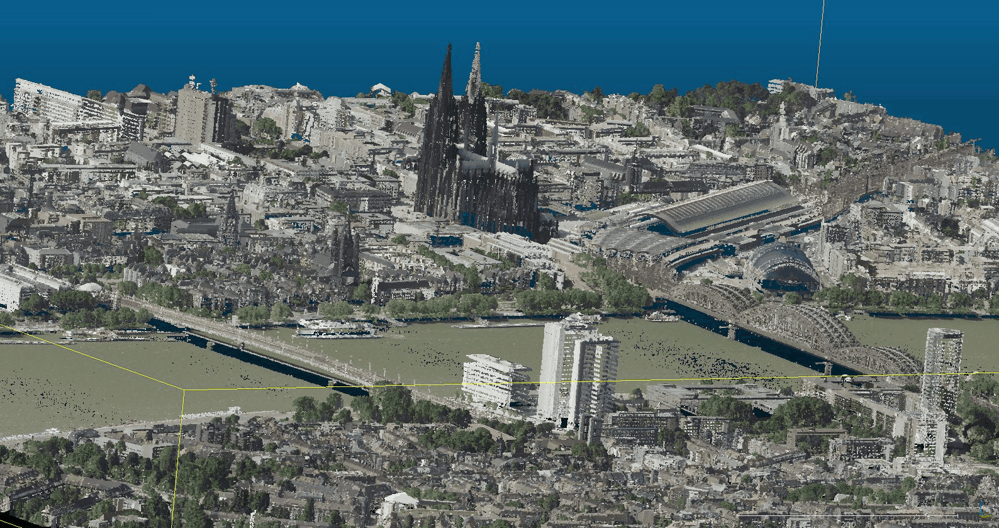

Scripts to process openNRW data: LiDAR Punktwolken DGM1L - point clouds, ~4 returns/sqm, LAZ format

 * lidar: LiDAR point clouds, ~4 returns/sqm, provided as ZIP files, by municipality
     * Overview: https://www.bezreg-koeln.nrw.de/brk_internet/geobasis/hoehenmodelle/3d-messdaten/index.html
     * Flight plan: https://www.tim-online.nrw.de/tim-online2/uebersicht.html?thema=dhm
     * Georeferenzierung:
         * Lage / Lageangabe: ETRS89/UTM32 (EPSG 25832)
         * Höhe / Höhenangabe: DHHN2016 (EPSG 7837)
     * Punktdichte: Mittlere Punktdichte: 4 - 10 Pkt/m^2
     * Data download (2.2 TB of ZIP files):
         * https://www.opengeodata.nrw.de/produkte/geobasis/hm/3dm_l_las/

Hint: the DGM is already available as gridded 1m DGM (see https://github.com/mundialis/openNRW/tree/master/dgm).

</a>


## LiDAR file content

Source: https://www.bezreg-koeln.nrw.de/brk_internet/geobasis/hoehenmodelle/nutzerinformationen.pdf

 * X
 * Y
 * Z
 * Intensity [Intensität]
 * Return Number [Reflexionsnummer]
 * Number of Returns [Anzahl der Reflexionen]
 * Classification [Klassifikation]
 * Scan Angle Rank (-90 to +90) - Left side [Scanwinkel]
 * User Data (belegt mit der Pulse width [Echoweite])
 * GPS Time [GPS Zeit]

## Data processing steps

### Fetch Lidar point cloud data (LAZ)

 * `01_fetch_openNRW_LIDAR_list.sh`: Fetch list of openNRW LIDAR LAZ ZIP file list, for easier file download (run script to download files, e.g. with `wget`)

## Generate LAZ tile index from all LAZ files

```bash
# example for Bonn
unzip 3dm_l_las_05314000_Bonn_EPSG4647.zip
# be sure to quote the input wildcard "*.laz"
STADT=bonnn
pdal tindex create openNRW_LiDAR_tileindex_files_${STADT}.gpkg "*.laz" -f GPKG --lyr_name "openNRW_${STADT}" --t_srs "EPSG:25832"
```

## Bonus track: Colorize point cloud with respective RGB Orthophoto values

Script to colorize LiDAR point cloud with RGB values from related orthophoto:

 * `lidar_colorize_pdal.sh`: requires to edit `pdal_filter_add_rgb.json`

## Online LiDAR viewer

 * https://plas.io - WebGL point cloud rendering

## PDAL Workshop material

 * Howard Butler et al, 2019: Point Cloud Processing and Analysis with PDAL, https://pdal.s3.amazonaws.com/workshop/PDAL-workshop.pdf
